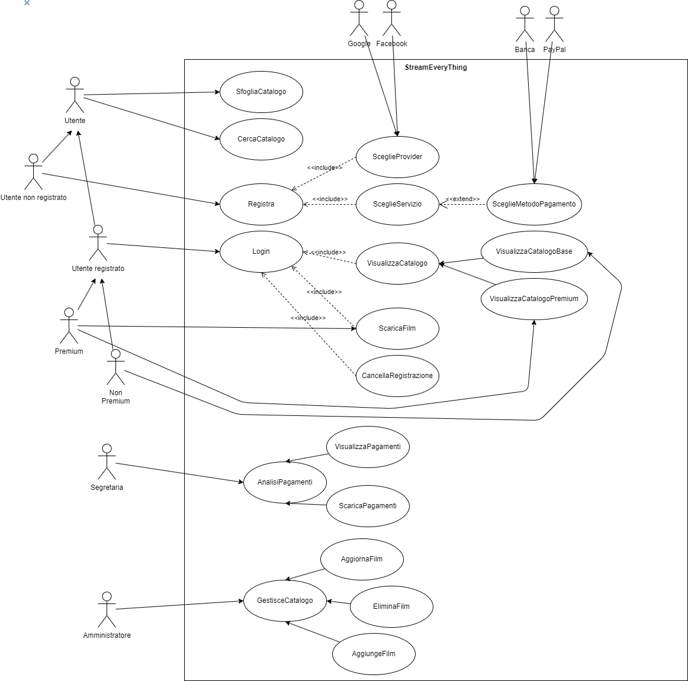

# Caso d'uso: CercaCatalogo
## Breve Descrizione:
Il cliente cerca un film o una serie tv nel catalogo
## Attori primari:
- Utente
## Attori secondari:
Nessuno
## Precondizioni:
Nessuna
## Sequenza degli eventi principale:
1. Il cliente seleziona la funzionalità di ricerca
2. Il sistema chiede al cliente i criteri di ricerca (ad esempio il titolo del film/serie tv o un genere)
3. Il cliente inserisce i criteri di ricerca
4. Il sistema cerca i film/serie tv che soddisfano i criteri di ricerca
5. Se il sistema trova uno o più film/serie tv

    5.1 Il sistema visualizza i risultati della ricerca
6. Altrimenti

    6.1 Il sistema comunica al cliente che non sono stati trovati film/serie tv che soddisfano i criteri di ricerca
## Postcondizioni:
Nessuna
## Sequenza degli eventi alternativa:
Nessuna

# Caso d'uso: Registra
## Breve Descrizione:
Il sistema crea un nuovo account per l'utente
## Attori primari:
- Utente non registrato
## Attori secondari:
- Google
- Facebook
- Banca
- Paypal
## Precondizioni:
L'utente non è registrato
## Sequenza degli eventi principale:
1. L'utente seleziona la funzionalità di registrazione
2. L'utente seleziona il metodo di registrazione
3. Se l'utente seleziona Google

    3.1 Il sistema reindirizza l'utente alla pagina di login di Google
    3.2 L'utente effettua il login con le credenziali di Google
    3.3 Il sistema crea un account per l'utente con le informazioni di Google
4. Altrimenti se l'utente seleziona Facebook
    
    4.1 Il sistema reindirizza l'utente alla pagina di login di Facebook
    4.2 L'utente effettua il login con le credenziali di Facebook
    4.3 Il sistema crea un account per l'utente con le informazioni di Facebook
5. Altrimenti inserisce manualmente i dati (nome, cognome, email, password)
6. Il sistema valida i dati inseriti
7. Il sistema chiede all'utente quale servizio scegliere (gratuito, premium)
8. L'utente sceglie il servizio
9. Se l'utente sceglie il servizio premium

    9.1 Il sistema chiede all'utente di scegliere il metodo di pagamento (Banca, Paypal)

    9.2 Se l'utente sceglie Banca

       9.2.1 Il sistema chiede all'utente i dati della carta di credito

       9.2.2 Il sistema verifica i dati della carta di credito
    
    9.3 Se l'utente sceglie Paypal

       9.3.1 Il sistema reindirizza l'utente alla pagina di login di Paypal

       9.3.2 L'utente effettua il login con le credenziali di Paypal

    9.4 Il sistema assegna all'utente il servizio premium
10. Altrimenti
    
    10.1 Il sistema assegna all'utente il servizio gratuito
11. Il sistema crea un account per l'utente con i dati inseriti
## Postcondizioni:
Si viene creata un'utenza
## Sequenza degli eventi alternativa:
IndirizzoMailNonValido, PasswordNonValida, DatiCartaNonValidi